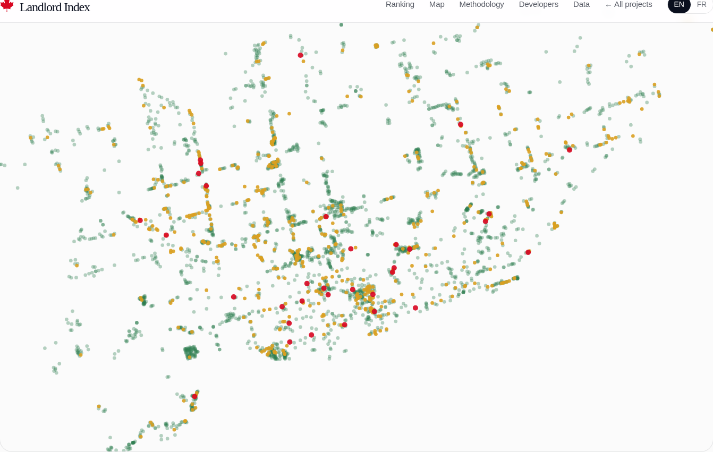
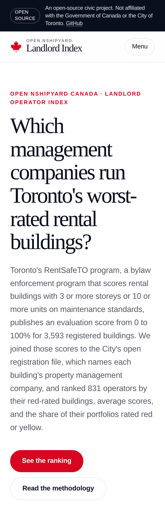

# Landlord Operator Index

Which property-management companies in Toronto run the most red-rated RentSafeTO buildings, and which have the worst average scores across their portfolios?

Live: https://landlord.canada.nshipyard.com

## What this is

Toronto's RentSafeTO program (a bylaw enforcement program that scores rental buildings with 3 or more storeys or 10 or more units on maintenance standards) publishes an evaluation score from 0 to 100% for 3,593 registered buildings. This project joins those scores to the City's open apartment building registration file, which names each building's property management company, normalizes 953 raw name spellings into 831 canonical operators, and ranks every operator by red-rated buildings, average score, units under management, and the share of its portfolio rated red or yellow.

Headline figures (snapshot, evaluation vintage 2026-10-08):
- 3,593 buildings with a published score; 831 operators ranked
- 34 red-rated buildings (0.9%) and 557 yellow-rated (15.5%); city average score 90.6
- 473 buildings (13.2%) name no management company; kept in a separate bucket, counted, never ranked as a company
- 953 raw name spellings normalized to 831 operators (17 fuzzy merges, all logged)

The hard rule, stated on the page: the open file names the property MANAGEMENT company, not the legal owner. A company that manages a building is not necessarily the company that owns it.

## Screenshots

## Data sources

- Apartment Building Evaluation, City of Toronto Open Data: https://open.toronto.ca/dataset/apartment-building-evaluation/ (refreshed 2026-10-08)
- Apartment Building Registration, City of Toronto Open Data: https://open.toronto.ca/dataset/apartment-building-registration/ (refreshed 2026-07-05)

Licence: Open Government Licence - Toronto. This project's derived files are MIT licensed.

## Methodology

1. Download both tables via the CKAN datastore API (`scripts/ingest.py`; raw rows cached in `data/raw/`, not committed).
2. Dedup evaluations to the latest per building registration number (RSN): 6,902 rows become 3,593 buildings.
3. Join to registrations on RSN: 3,591 of 3,593 matched.
4. Normalize operator names: uppercase, strip 14 legal-entity suffixes, exact match, then a fuzzy pass (difflib ratio 0.93 or higher with the same first token, union-find) with 17 merges. The full raw-to-canonical mapping is committed as `data/operator_name_map.csv`.
5. Compute per-operator stats: red/yellow/green counts, average score, total units, portfolio shares.
6. Door-sign bands follow the City's colour-coded rating system (July 2026): green 85-100%, yellow 70-84%, red 0-69%.

Outputs committed: `data/operators.json`, `data/buildings.json`, `data/summary.json`, `data/operator_name_map.csv`, `data/operator_merges.json`, plus CSV/JSON downloads in `public/data/`.

## API

- `GET /api/v1/operators?q=&sort=&limit=` (sort: red, share, score, buildings)
- `GET /api/v1/buildings?q=&operator_id=&sign=&ward=&limit=`
- `GET /api/v1/summary`
- `GET /api/openapi.json` (OpenAPI 3.1)
- `POST /mcp` (MCP server over streamable HTTP; tools: operator_ranking, building_lookup, methodology)

## Caveats

- Operator-level only, not legal ownership.
- Snapshot vintage, not live scores (evaluations refresh on a multi-year cycle).
- 473 buildings with blank management-company names are counted separately, not ranked.
- Small portfolios swing: a 2-building company with one red building shows 50% red.

## Built by

Built by Richardson Dackam · [X](https://x.com/richardsondx) · [GitHub](https://github.com/richardsondx)

An Open Nshipyard project. Not affiliated with the Government of Canada or the City of Toronto.
