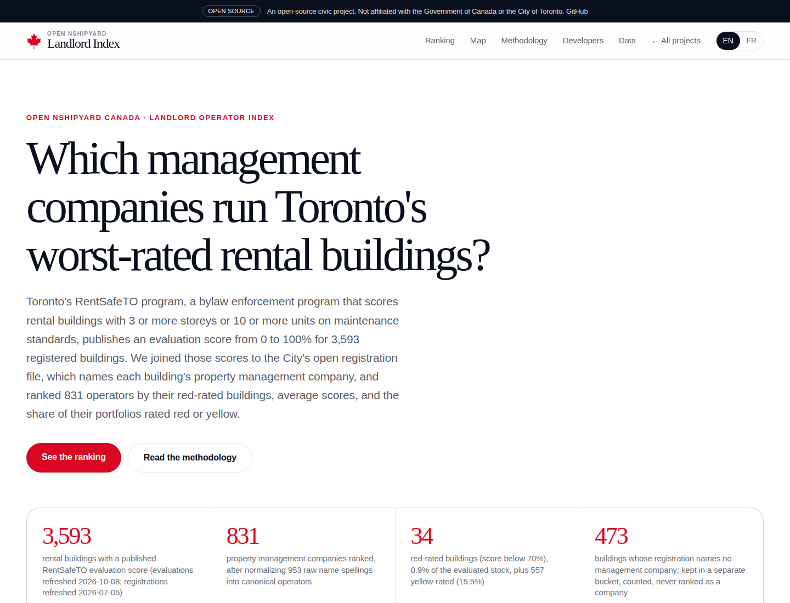
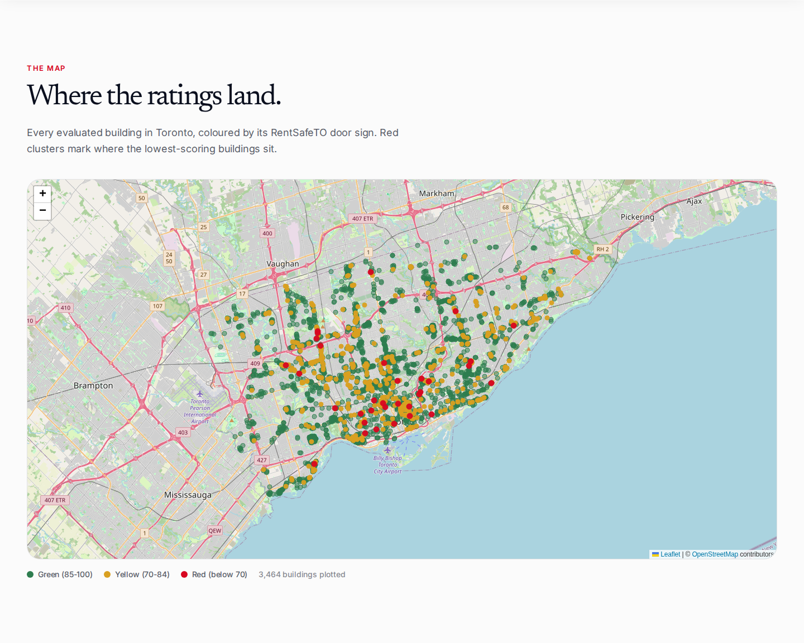
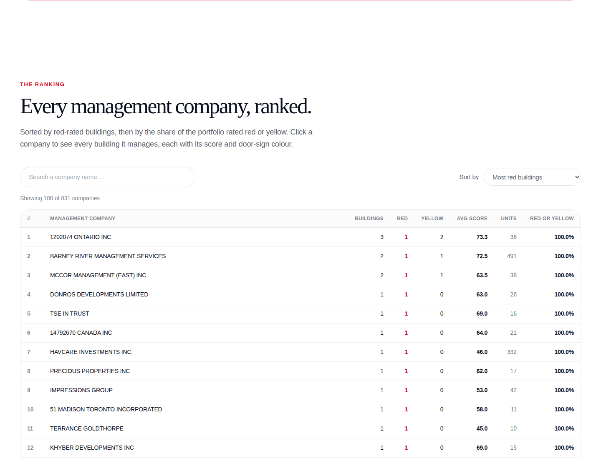

# Landlord Index

**Live:** https://landlord.canada.nshipyard.com

Toronto's RentSafeTO program (a bylaw enforcement program that scores rental buildings with 3 or more storeys or 10 or more units on maintenance standards) publishes a 0 to 100% evaluation score for 3,593 registered buildings. This project joins those scores to the City's open apartment building registration file, which names each building's property management company, normalizes 953 raw name spellings into 831 canonical operators, and ranks every operator by red-rated buildings, average score, units under management, and the share of its portfolio rated red or yellow.





## Key figures (evaluation vintage 2026-10-08)

- 3,593 buildings carry a published score; 831 operators are ranked from them.
- 34 buildings are red-rated (0.9% of stock), spread so thin that no single operator manages more than one; 557 are yellow-rated (15.5%); the city average score is 90.6.
- 473 buildings (13.2%) name no management company in the registration file; they sit in a separate unattributed bucket, counted but never ranked as a company.
- 953 raw name spellings collapsed into 831 operators through 17 fuzzy merges, each one logged in `data/operator_merges.json`.

The hard rule, stated on the page: the open file names the property MANAGEMENT company, not the legal owner. A company that manages a building is not necessarily the company that owns it, so every ranking here is operator-level.

## What the page does

- Ranked operator table, sortable by red-rated buildings, red share of portfolio, average score, and building count, with full-text search across operator names.
- Building map: all 3,593 buildings plotted on a Leaflet map (Leaflet, the open-source JavaScript mapping library), coloured by the City's door-sign bands: green 85-100%, yellow 70-84%, red 0-69%.
- English and French: the EN/FR toggle switches the full interface, methodology, and API documentation.
- Agent access: the same files that feed the page are published for download and served through a REST API, an OpenAPI 3.1 spec, and an MCP server (Model Context Protocol, the open standard that lets AI assistants call tools), so agents can query operator rankings and building lookups without scraping.

## API

- `GET /api/v1/operators?q=&sort=&limit=` (sort: red, share, score, buildings)
- `GET /api/v1/buildings?q=&operator_id=&sign=&ward=&limit=`
- `GET /api/v1/summary`
- `GET /api/openapi.json` (OpenAPI 3.1)
- `POST /mcp` (MCP server over streamable HTTP; tools: operator_ranking, building_lookup, methodology)

CSV and JSON downloads of every derived file ship in `public/data/`.

## Data sources

- Apartment Building Evaluation, City of Toronto Open Data, refreshed 2026-10-08: https://open.toronto.ca/dataset/apartment-building-evaluation/
- Apartment Building Registration, City of Toronto Open Data, refreshed 2026-07-05: https://open.toronto.ca/dataset/apartment-building-registration/

Licence: Open Government Licence - Toronto (the City's open data licence). This project's derived files are MIT licensed.

## How the numbers are built

`scripts/ingest.py` (Python standard library only) runs the pipeline:

1. Downloads both tables through the City's CKAN data API (CKAN, the open-source data portal software behind open.toronto.ca); raw rows are cached in `data/raw/`, not committed.
2. Deduplicates 6,902 raw evaluation rows to the latest score per building registration number (RSN): 3,593 buildings.
3. Joins to registrations on RSN: 3,591 of 3,593 match.
4. Normalizes operator names: uppercases, strips 14 legal-entity suffixes, exact-matches, then a fuzzy pass (difflib ratio 0.93 or higher with the same first token, union-find) producing 17 merges. The full raw-to-canonical mapping is committed as `data/operator_name_map.csv`.
5. Computes per-operator stats: red/yellow/green counts, average score, total units, portfolio shares.
6. Writes committed outputs: `data/operators.json`, `data/buildings.json`, `data/summary.json`, `data/operator_merges.json`, plus the downloads in `public/data/`.

## Run it locally

```bash
npm install
npm run dev
```

The app serves at `http://localhost:3000`. To rebuild the dataset from the City's current files instead of using the committed snapshot:

```bash
python3 scripts/ingest.py
```

## Caveats

- Operator-level only, never legal ownership: the source identifies the management company.
- Snapshot vintage, not live scores: evaluations refresh on a multi-year cycle.
- 473 buildings with blank management-company names are counted separately, not ranked.
- Small portfolios swing hard: a 2-building company with one red building shows 50% red.

## Built by

Built by Richardson Dackam, https://x.com/richardsondx, https://github.com/richardsondx

An Open Nshipyard project. Not affiliated with the Government of Canada or the City of Toronto.
